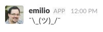

# Slasciimoji - Slack ASCII Emojis

I know, most of these include unicode characters. Deal with it (⌐■_■)

## Usage

Open a slack channel and write `/ascii help` (or just `/ascii`). You will get a list of all possible emojis, e.g.

```
Use one of these names to post an asciimoji
    shrug: ¯\_(ツ)_/¯
    zoidberg: (\/)(°,,,°)(\/)
    sunglasses: (⌐■_■)
    (...)
```
Pick one you like or that fits the current situation, e.g. `shrug`. Then write `/ascii shrug`, and the Slasciimoji Bot 
will post an emoji in your name. 



## Installation

Go to the [Slack API](https://api.slack.com/) page and create a new Application for you team.
Create a `Verification Token`.
Go to the `OAuth & Permissions` menu and create an `OAuth Access Token`. Add following permissions to the token:

- chat:write:user
- users:read

Create a `.env` file in the root dir of this application with the content

```
SLACK_SLASH_COMMAND_TOKEN=your_verification_token
SLACK_TOKEN_OAUTH=your_oauth_token
```

Use the provided Dockerfile to create a Docker-Container and deploy it to the platform of your least distrust.

Got to the Menu `Slash Commands` and create a Slash Command called `/ascii`. 
Write the URL under which your application instance can be accessed into `Request URL`.
Write a `short description`, e.g. `Post an ascii / unicode emoji`. Write an `usage hint` like `[help|emoji name]`

